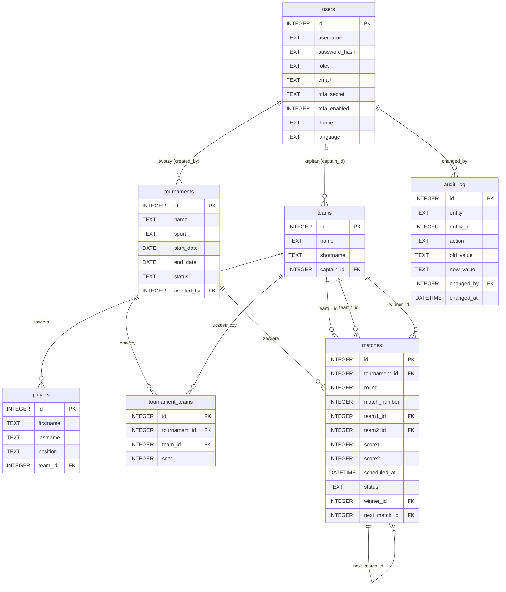

# Diagram bazy danych

## Tabele FTS5 (wyszukiwanie pełnotekstowe)

| Tabela wirtualna | Indeksowane kolumny | Tabela źródłowa |
|---|---|---|
| `tournaments_fts` | `name`, `sport` | `tournaments` |
| `teams_fts` | `name`, `shortname` | `teams` |
| `players_fts` | `firstname`, `lastname` | `players` |

Aktualizowane automatycznie przez triggery `AFTER INSERT / UPDATE / DELETE`.

## Role użytkowników

| Wartość | Rola |
|---|---|
| `0` | Administrator |
| `1` | Organizator |
| `2` | Kapitan drużyny |
